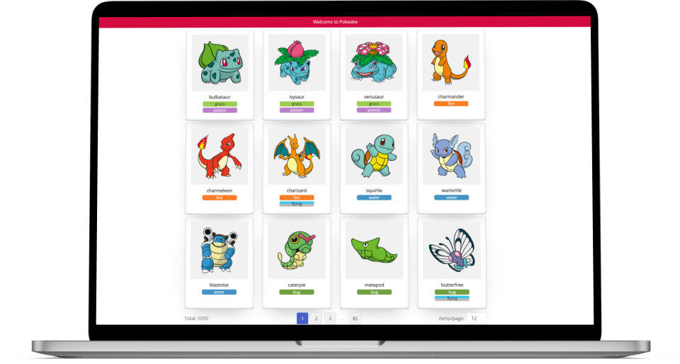

<h1 style="color: #333" align="center">Pokedex</h1>

  <a style="color: #F14668" href="#-project">Project</a>&nbsp;&nbsp;&nbsp;|&nbsp;&nbsp;&nbsp;
  <a style="color: #F14668" href="#-technologies">Technologies</a>&nbsp;&nbsp;&nbsp;|&nbsp;&nbsp;&nbsp;
  <a style="color: #F14668" href="#-backlog">Backlog</a>&nbsp;&nbsp;&nbsp;|&nbsp;&nbsp;&nbsp;
  <a style="color: #F14668" href="#-layout">Layout</a>&nbsp;&nbsp;&nbsp;|&nbsp;&nbsp;&nbsp;
  <a style="color: #F14668" href="#-auhtors">Auhtors</a>

 

  

## 📋 Project

A software that accesses the pokemon public API (<a style="color: #F14668" href="https://pokeapi.co/">Pokeapi.co</a>) and displays pokemon data to the user.

## 🖥️ Technologies

The project was developed using the following technologies:

- <a style="color: #F14668" href="https://nodejs.org/en/">Node.js</a>
- <a style="color: #F14668" href="https://angular.io/">Angular</a>
- <a style="color: #F14668" href="https://www.typescriptlang.org/">TypeScript</a>
- <a style="color: #F14668" href="https://bulma.io/">Bulma</a>
- <a style="color: #F14668" href="https://sass-lang.com/">SASS</a>
- <a style="color: #F14668" href="https://karma-runner.github.io/latest/index.html">Karma</a>
- <a style="color: #F14668" href="https://jasmine.github.io/">Jasmine</a>
- <a style="color: #F14668" href="https://rxjs.dev/">RxJS</a>
- <a style="color: #F14668" href="https://pages.github.com/">Github Pages</a>

## 💭 Backlog

List of features and their respective progress:

- [x] Integration with <a style="color: #F14668" href="https://pokeapi.co/">Pokeapi.co</a>
- [x] Pokemon list pagination
- [ ] Show more information about a specific pokemon
- [ ] Responsive for all devices (from 320px to 1920px)
- [ ] Show Skeleton while data is loading
- [ ] Show pokemon list as a table (toogle button)
- [ ] 90% unit test coverage
- [ ] Dark mode

List of devops setup and their respective progress:
- [ ] Deploy with <a style="color: #F14668" href="https://pages.github.com/">Github Pages</a>
- [ ] Creating a pipeline (CI/CD)

## 🎨 Layout

All prototypes were tested using <a style="color: #F14668" href="http://figma.com/">Figma</a>.

- <a style="color: #F14668" href="https://www.figma.com/file/ANko09UzvbWxy6ZueM3bMr/Untitled?node-id=0%3A1&t=xUCAJximGOO8yH7J-1">Responsive Layout Prototype</a>

## ☕ Authors

- <a style="color: #F14668" href="https://www.linkedin.com/in/lucaslessa7/">Lucas Lessa</a>
